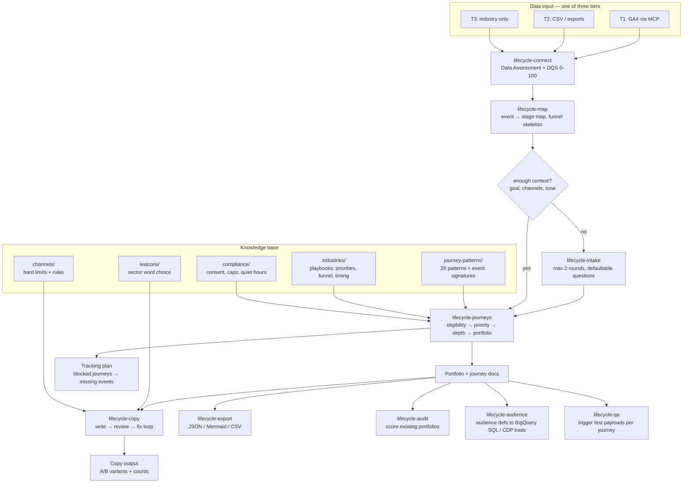

# Architecture

claude-lifecycle is a data-adaptive pipeline: the same engine produces different portfolios depending on what the data can support. Industry differences live in **data files** (playbooks, lexicons), never in skill logic.

## Pipeline

## Design decisions

**One engine, data-driven sectors.** Adding a sector = adding `knowledge/industries/<x>.md` + `knowledge/lexicons/<x>.md`. The engine never contains `if sector == "fintech"` logic; it reads priorities, funnels, timing, and vocabulary from the files.

**Multi-vertical brands are N single-industry runs, not one blended one.** A company with genuinely separate product lines — each its own funnel, its own conversion event — declares `verticals` in its brand config; DQS, funnel completeness, and pattern eligibility are computed **once per vertical** against that vertical's own industry file, never blended into one number that would hide a weak vertical behind a strong one. The one exception is frequency-cap conflict review, which stays company-wide: a real user sits in one inbox regardless of how many of the company's verticals they're a customer of.

**DQS as the sophistication governor.** Journey depth (3 steps vs 10+) is a deterministic function of data quality, documented in [data-quality-score.md](data-quality-score.md). This keeps the engine honest: rich branched journeys are only proposed when the events to trigger and measure them actually exist.

**Eligibility via event signatures.** Every pattern declares `required_events` in frontmatter. Patterns that don't match the user's events aren't silently skipped — they become tracking-plan items with the value they'd unlock, turning gaps into a roadmap.

**Copy as a reviewed artifact.** Channel files define hard limits; lexicons define vocabulary; the copy-reviewer agent enforces both adversarially. Copy that hasn't passed review never reaches the user.

**Subagent economics.** Big event inventories go to `event-analyst` (keeps raw data out of the main context); P0 journeys can each get a dedicated `journey-architect`; `copy-writer`/`copy-reviewer` form a generator/discriminator pair.

## Where state lives

The plugin is stateless between sessions by design. Generated artifacts (assessment, portfolio, journeys, copy, exports) are written to a local `output/<project>/` directory — gitignored, because they contain the user's business data. Re-running `connect` after tracking improvements recomputes everything downstream.
