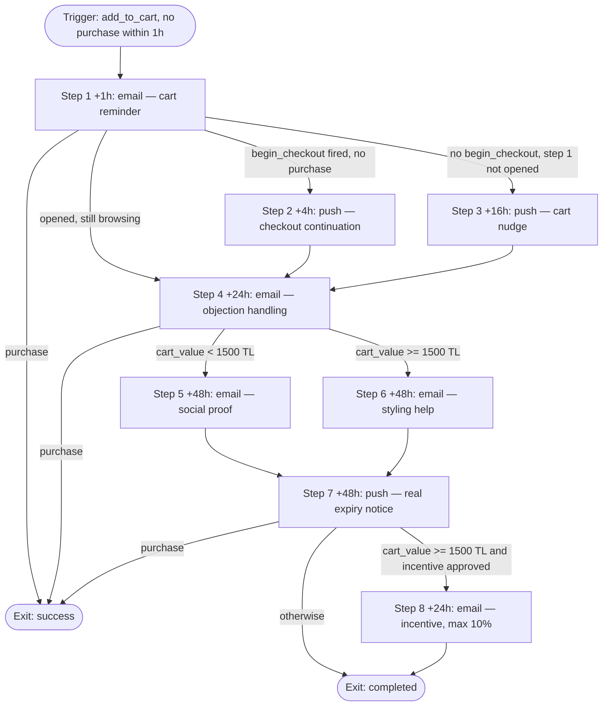

# Journey: Cart Recovery

**ID:** `ecom-abandoned-cart-01` · **Pattern:** [abandoned-cart](../../knowledge/journey-patterns/abandoned-cart.md) · **Priority:** P0
**Data tier:** T1 · **DQS at generation:** 74/100 · **Depth class:** branched (7–12)

## 1. Objective (required)

Recover revenue from abandoned carts; primary KPI is **cart recovery rate** (purchases within the 7-day window / journeys entered).

## 2. Trigger & entry (required)

| Field | Value |
|---|---|
| Trigger type | event-based |
| Trigger | `add_to_cart` (arming window 1h — journey enters only if no `purchase` within 1h) |
| Entry conditions | cart non-empty after 1h · messageable on ≥ 1 channel (consent checked per channel per step) · identified user (`user_id` present) |
| Re-entry policy | once per 7 days |
| Quiet hours | push 22:00–09:00 blocked, staggered 09:00–11:00 on release; email avoids 00:00–06:00 (per [consent-and-quiet-hours.md](../../knowledge/compliance/consent-and-quiet-hours.md)) |

## 3. Audience (required)

- **Who enters:** identified users whose cart is non-empty 1 hour after the last `add_to_cart`, with no `purchase` since.
- **Who is excluded:** purchased in the last 24h (identity-stitched) · currently in a transactional flow (order/shipping) · cart value below 150 TL (low-value floor from intake) · users in `ecom-post-purchase-01`.
- **Estimated volume:** ≈ 650 entrants/week (estimate: identified & email-consented share of ~340 abandoned carts/day; from 61,900 `add_to_cart` / 90d).

## 4. Exit & success criteria (required)

- **Success (conversion) exit:** `purchase` (any, identity-stitched) — user leaves the journey immediately.
- **Other exits:** unsubscribe (exits that channel's steps; whole journey if it was the only consented channel), journey completed, cart emptied by user, entered higher-priority transactional flow.
- **Success window:** 7 days (matches the real cart lifetime — guest carts purge on day 7).

## 5. Steps (required)

| # | Wait | Channel | Message intent | Branch condition | Copy ref |
|---|------|---------|----------------|------------------|----------|
| 1 | +1h after trigger | email | Cart reminder: contents + free-shipping threshold, zero pressure | — | step-1 |
| 2 | +4h | push | Checkout continuation: resume payment step, deeplink to checkout | if `begin_checkout` fired, no purchase | step-2 |
| 3 | +16h | push | Short cart nudge, deeplink to cart | if no `begin_checkout` AND step 1 not opened | step-3 |
| 4 | +24h | email | Objection handling: shipping cost, 30-day returns, payment options | — | step-4 |
| 5 | +48h | email | Social proof on cart items (reviews, "X kişi bu ürünü aldı" from real data) | if `cart_value` < 1500 TL | step-5 |
| 6 | +48h | email | High-value cart: personal styling help offer (human reply-to) | if `cart_value` ≥ 1500 TL | step-6 |
| 7 | +48h | push | Real expiry notice: cart purges on `{{cart_expiry_date}}` (true system date) | — | step-7 |
| 8 | +24h | email | Incentive (max 10%), approval-gated per intake policy | if `cart_value` ≥ 1500 TL AND incentive approved | step-8 |

Branch notes: steps 2 and 3 are mutually exclusive (checkout-abandoners vs cart-abandoners); steps 5 and 6 are mutually exclusive (value gate). Worst-case single-user load: 4 emails + 2 pushes in 7 days — exactly at the email cap, which is why the portfolio defers all P2 sends for users in this journey.

## 6. Measurement (required)

| KPI | Type | Definition | Target |
|---|---|---|---|
| Cart recovery rate | primary | `purchase` within 7-day window / journeys entered | baseline after 4 weeks |
| Revenue per entrant | secondary | recovered `purchase.value` (TRY) / journeys entered | baseline after 4 weeks |
| Unsubscribe rate per send | guardrail | unsubscribes / delivered, per email step | < 0.3% per send |
| Push opt-out rate | guardrail | push permission revocations / push delivered | < 0.5% per send |

- **Holdout:** 10% global holdout for 4 weeks (required at T1) — recovery rate is only claimable against it.
- **A/B plan:** step-1 subject line, Variant A ("Sepetin seni bekliyor…") vs Variant B ("{{product_name}} hâlâ sepetinde") — see [copy doc](04-copy-cart-recovery.md).

## 7. Frequency & compliance notes (required)

- This journey may consume a user's **entire weekly email budget** (4/4). While a user is active here: browse-abandonment is excluded by entry condition; NPS/milestone/anniversary sends are deferred until exit (portfolio §4 rule). On trigger conflict, Cart Recovery wins over Welcome (`ecom-welcome-onboarding-01` pauses).
- Consent: email requires İYS-registered opt-in (TR market, KVKK); push requires OS-level opt-in — both checked per step, not per journey. No SMS/WhatsApp steps (no consented audience).
- Step 8's incentive requires human approval before activation (intake: max 10%, last step only).
- Urgency claims use real data only: `{{cart_expiry_date}}` is the actual purge date; no manufactured scarcity (lexicon rule).

## 8. Flow diagram (required)

(`purchase` exits apply at every step; drawn at representative points to keep the diagram readable.)

## 9. Data gaps *(if applicable)*

- `cart_value` is computed CRM-side from synced `add_to_cart`/`remove_from_cart` events — a native cart-state attribute would remove drift risk.
- RFM attributes would allow suppressing the step-8 incentive for discount-affine users (they buy anyway); cross-referenced in the portfolio's tracking-plan summary ([02-portfolio.md §6](02-portfolio.md)).
