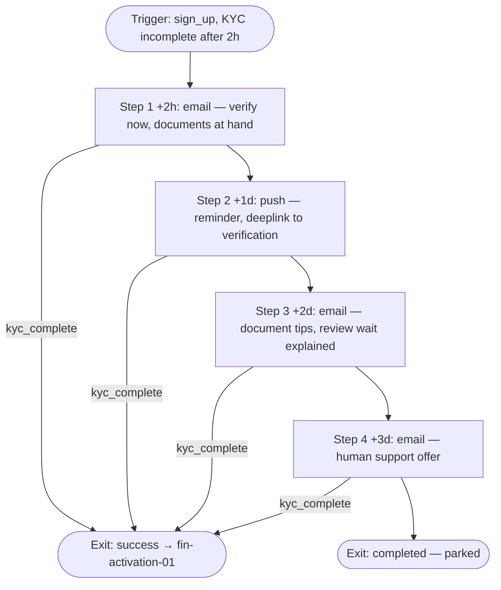
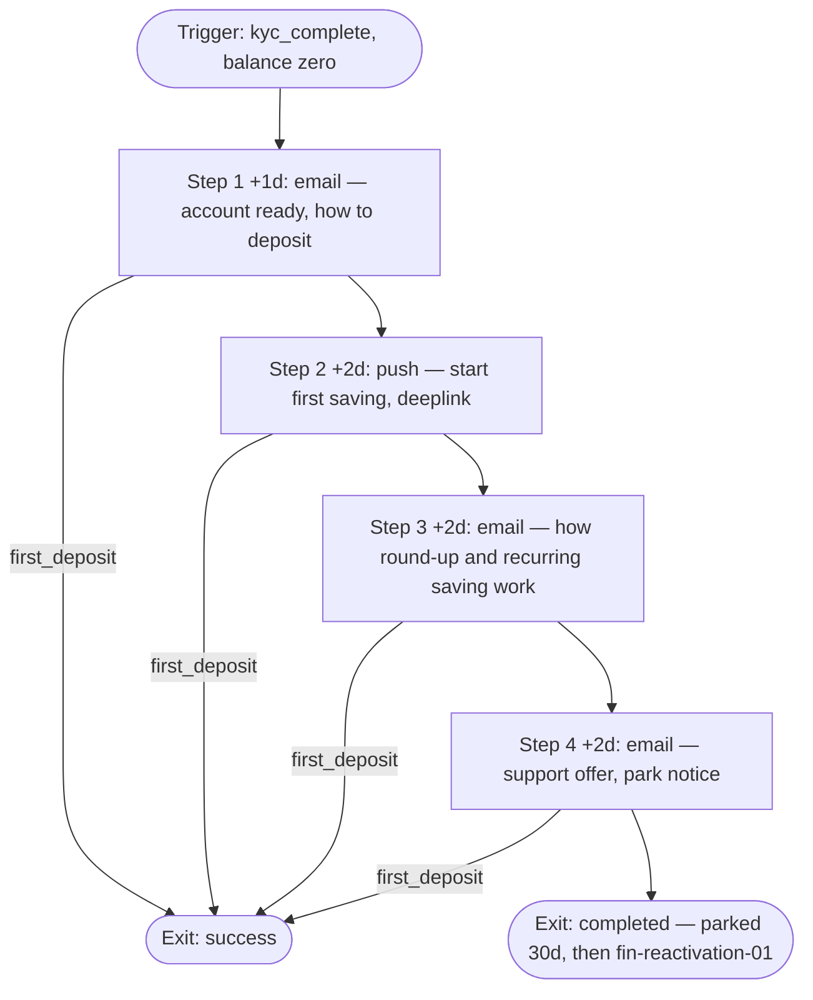
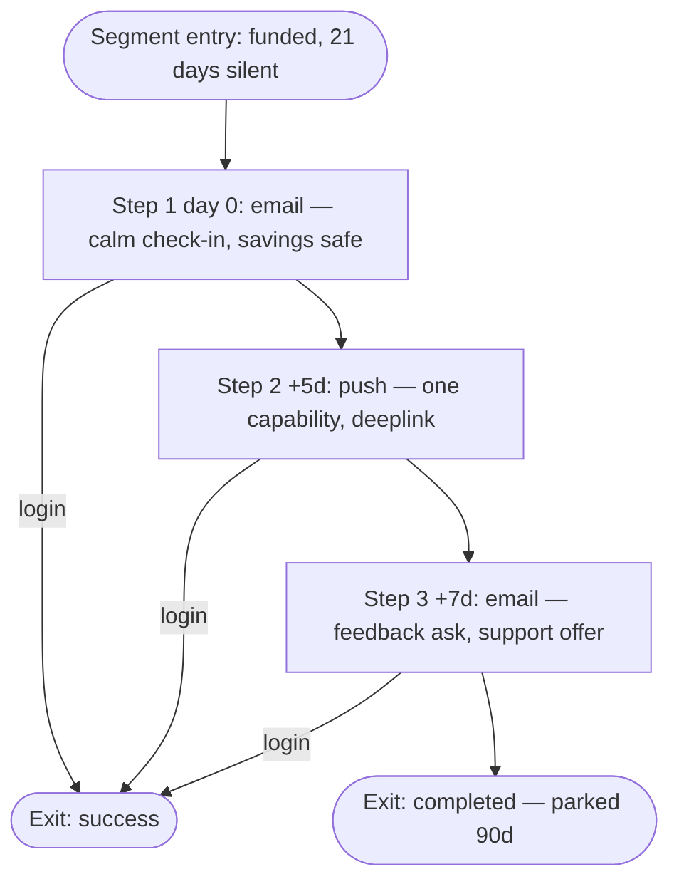
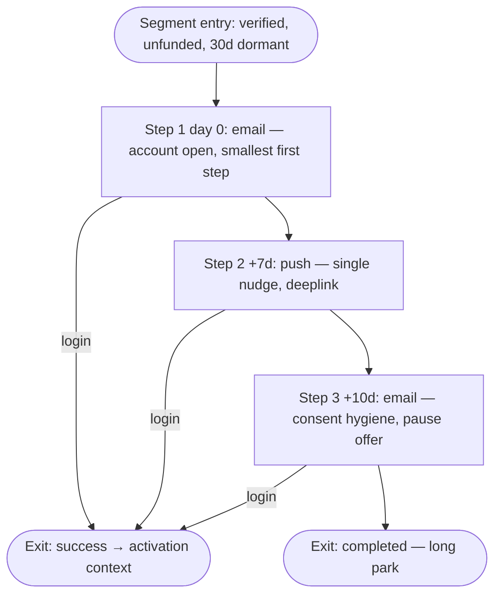

# Lifecycle Journey Portfolio — Parapuan

**Generated:** 2026-07-12 · **Industry:** fintech · **Data tier:** T3 · **DQS:** 0/100
**Goal weighting:** activation-first (KYC → first deposit)

## 1. Executive summary

No data source is connected, so this portfolio is built entirely from the [fintech playbook](../../knowledge/industries/fintech.md) and the intake answers: four **simple-class** journeys (3–5 steps, time-based waits, email primary + push support) covering the two activation gates (KYC, first deposit), funded-account dormancy, and unfunded reactivation. Every volume is "estimate after launch" and no journey claims a revenue KPI until `first_deposit` is instrumented. Launch first: `fin-welcome-onboarding-01` — the playbook is unambiguous that most fintech acquisition spend dies at the KYC gate. The [tracking plan](02-tracking-plan.md) is the other half of this deliverable.

**Honest limitations of a T3 portfolio:** timing values are playbook defaults, not observed behavior · there is no branching because nothing exists to branch on · triggers/exits name events (`sign_up`, `kyc_complete`, `first_deposit`, `login`) that the app backend must send to the CRM before launch — the minimum integration, itemized as P0 in the tracking plan · all copy passes compliance review before send (intake answer 1).

## 2. Portfolio table

| # | Journey | ID | Stage | Priority | Depth | Channels | Status |
|---|---------|----|----|----------|-------|----------|--------|
| 1 | KYC Rescue | `fin-welcome-onboarding-01` | Activation | P0 | 4 steps, simple | email+push | ✅ generated |
| 2 | First Deposit Bridge | `fin-activation-01` | Activation | P0 | 4 steps, simple | email+push | ✅ generated |
| 3 | Dormancy Save | `fin-churn-prevention-01` | Retention | P0 | 3 steps, simple | email+push | ✅ generated |
| 4 | Unfunded Reactivation | `fin-reactivation-01` | Engagement | P1 | 3 steps, simple | email+push | ✅ generated |
| 5 | Payment Failure (Dunning) | `fin-payment-failure-01` | Revenue | P1→P0* | — | — | 🔒 blocked — requires `payment_failed` events from the payment provider |
| 6 | Feature Adoption | `fin-feature-adoption-01` | Engagement | P1 | — | — | 🔒 blocked — requires `feature_used` with a `feature` param |

\* Playbook: promote dunning to P0 for products with recurring deposits — Parapuan has them, so this is the highest-value blocked journey.

Referral and upsell-cross-sell stay out entirely: both need compliance sign-off that does not exist yet (intake answer 4; playbook rationale).

## 3. Lifecycle stage coverage

| Stage | Journeys | Coverage verdict |
|---|---|---|
| Acquisition | — | not applicable — engine works from `sign_up` onward |
| Activation | `fin-welcome-onboarding-01`, `fin-activation-01` | covered — the sector's two gates each get a journey |
| Engagement | `fin-reactivation-01` | covered (feature-adoption blocked on instrumentation) |
| Revenue | — | gap — dunning is blocked on `payment_failed`; no other revenue journey is appropriate pre-instrumentation. Unblocked by tracking-plan item 4. |
| Retention | `fin-churn-prevention-01` | covered |
| Winback | — | gap — a lapsed-*funded*-user winback needs transaction recency data that does not exist yet; deliberately deferred (playbook: never lean on urgency here). |

## 4. Conflict & frequency review

- **KYC Rescue vs First Deposit Bridge vs Unfunded Reactivation:** sequential by construction — each journey's entry condition is a later lifecycle state (`sign_up` without KYC → `kyc_complete` without deposit → funded-never dormancy). No user is in two at once.
- **Dormancy Save:** funded accounts only — disjoint from all three above.
- **Transactional separation (playbook hard rule):** no journey send is scheduled within 4h of a security or transaction alert; journeys never imitate transactional formats.
- **Self-imposed cap:** ≤ 4 marketing messages/user/week — half the [default combined cap](../../knowledge/compliance/consent-and-quiet-hours.md), per the playbook's "fewer, heavier messages" rule. Worst case is KYC Rescue's first week: 3 emails + 1 push = **4/4 self-imposed (8 default)** — at the self-imposed cap, so no other journey may touch a user in KYC Rescue (guaranteed by the sequential entry conditions above).
- **Quiet hours strictly enforced:** push 22:00–09:00, SMS/WhatsApp not used at all in this portfolio; money messages at night read as fraud alerts.

## 5. Launch roadmap

1. **Week 1 — `fin-welcome-onboarding-01` (KYC Rescue):** the playbook's highest-leverage journey; requires only `sign_up` + `kyc_complete` reaching the CRM.
2. **Week 2 — `fin-activation-01` (First Deposit Bridge):** launch once `first_deposit` is instrumented (its success exit and KPI depend on it — hard precondition).
3. **Month 1 — `fin-churn-prevention-01` (Dormancy Save):** needs `login` (or session) events flowing for the 21-day dormancy segment.
4. **Month 2 — `fin-reactivation-01`:** only meaningful after a cohort has been through the deposit bridge and parked.
5. **After instrumentation — `fin-payment-failure-01`:** promote to P0 the moment `payment_failed` events exist (recurring deposits make this recovered revenue).

## 6. Tracking plan summary

2 blocked journeys; every generated journey also depends on minimum event integration. Top 3 items: (1) KYC funnel events with per-step failure reasons, (2) `first_deposit` with `value`/`currency`, (3) `payment_failed` with `failure_reason`. Full detail and projected DQS in [02-tracking-plan.md](02-tracking-plan.md).

---

# Journey: KYC Rescue

**ID:** `fin-welcome-onboarding-01` · **Pattern:** [welcome-onboarding](../../knowledge/journey-patterns/welcome-onboarding.md) · **Priority:** P0
**Data tier:** T3 · **DQS at generation:** 0/100 · **Depth class:** simple (3–5)

## 1. Objective (required)

Move signed-up users through identity verification; primary KPI is **KYC completion rate within 7 days**.

## 2. Trigger & entry (required)

| Field | Value |
|---|---|
| Trigger type | event-based (CRM event — backend must send `sign_up`; tracking-plan P0 item) |
| Trigger | `sign_up` |
| Entry conditions | KYC not complete · email or push consent present (İYS-registered for email) |
| Re-entry policy | once ever |
| Quiet hours | push 22:00–09:00 blocked (mandatory); email avoids 00:00–06:00 |

## 3. Audience (required)

- **Who enters:** new signups whose KYC is incomplete 2 hours after `sign_up`.
- **Who is excluded:** users who completed KYC in the first session; imported/migrated accounts.
- **Estimated volume:** unknown — estimate after launch.

## 4. Exit & success criteria (required)

- **Success (conversion) exit:** `kyc_complete` — user leaves immediately (hands off to `fin-activation-01`).
- **Other exits:** unsubscribe, journey completed (parked), account closed.
- **Success window:** 7 days.

## 5. Steps (required)

| # | Wait | Channel | Message intent | Branch condition | Copy ref |
|---|------|---------|----------------|------------------|----------|
| 1 | +2h after trigger | email | Verification is waiting — do it now while documents are at hand; what is needed and why | — | step-1 |
| 2 | +1d | push | Short reminder, deeplink to the verification screen | — | step-2 |
| 3 | +2d | email | Document tips: common rejection causes (blur, glare, mismatched selfie) and what the review wait means | — | step-3 |
| 4 | +3d | email | Final: human support offer (in-app chat / phone), then park | — | step-4 |

## 6. Measurement (required)

| KPI | Type | Definition | Target |
|---|---|---|---|
| KYC completion rate (7d) | primary | `kyc_complete` within window / journeys entered | baseline after 4 weeks |
| Unsubscribe rate per send | guardrail | unsubscribes / delivered, per email step | < 0.3% per send |

- **Holdout:** none at launch (T3 — volumes unknown); revisit after re-scoring.
- **A/B plan:** step-1 subject framing ("hesabını doğrula" vs "hesabın seni bekliyor") once volume supports it.

## 7. Frequency & compliance notes (required)

- Worst case 3 emails + 1 push in week 1 — exactly the portfolio's self-imposed 4/week cap; no other journey can reach this user (sequential entry conditions).
- Copy is compliance-reviewed before send; no promise of returns, no incentives (none permitted). KYC messages describe capability and process only.
- Never sent adjacent to OTP/security messages (4h clearance).

## 8. Flow diagram (required)

## 9. Data gaps *(if applicable)*

Per-step KYC events with failure reasons (`kyc_start`, `kyc_step_completed`) would turn steps 3–4 from generic tips into stall-specific rescue — the single biggest upgrade in the [tracking plan](02-tracking-plan.md).

---

# Journey: First Deposit Bridge

**ID:** `fin-activation-01` · **Pattern:** [activation](../../knowledge/journey-patterns/activation.md) · **Priority:** P0
**Data tier:** T3 · **DQS at generation:** 0/100 · **Depth class:** simple (3–5)

## 1. Objective (required)

Turn verified accounts into funded accounts; primary KPI is **first-deposit rate within 14 days** (requires `first_deposit` instrumented — hard launch precondition, see tracking plan).

## 2. Trigger & entry (required)

| Field | Value |
|---|---|
| Trigger type | event-based (CRM event `kyc_complete`) |
| Trigger | `kyc_complete` |
| Entry conditions | no deposit yet · email or push consent present |
| Re-entry policy | once ever |
| Quiet hours | push 22:00–09:00 blocked; email avoids 00:00–06:00 |

## 3. Audience (required)

- **Who enters:** users verified in the last 24h with a zero balance.
- **Who is excluded:** users who deposited during onboarding; accounts flagged by risk/compliance.
- **Estimated volume:** unknown — estimate after launch.

## 4. Exit & success criteria (required)

- **Success (conversion) exit:** `first_deposit` — user leaves immediately.
- **Other exits:** unsubscribe, journey completed (parked → eligible for `fin-reactivation-01` after 30 days), account closed.
- **Success window:** 14 days.

## 5. Steps (required)

| # | Wait | Channel | Message intent | Branch condition | Copy ref |
|---|------|---------|----------------|------------------|----------|
| 1 | +1d after trigger | email | "Your account is ready" — capability framing: how to deposit (transfer/card), minimum amount, where the money sits | — | step-1 |
| 2 | +2d | push | Start your first saving — deeplink to the deposit screen | — | step-2 |
| 3 | +2d | email | Educational: how round-up and recurring saving work — mechanics only, no advice, no market talk | — | step-3 |
| 4 | +2d | email | Support offer + park notice | — | step-4 |

## 6. Measurement (required)

| KPI | Type | Definition | Target |
|---|---|---|---|
| First-deposit rate (14d) | primary | `first_deposit` within window / journeys entered | baseline after 4 weeks |
| Unsubscribe rate per send | guardrail | unsubscribes / delivered, per email step | < 0.3% per send |

- **Holdout:** none at launch (T3); revisit after re-scoring.
- **A/B plan:** step-2 push framing (capability vs goal-setting) once volume supports it.

## 7. Frequency & compliance notes (required)

- 3 emails + 1 push over ~7 days — within the self-imposed 4/week cap; user cannot simultaneously be in any other journey.
- Playbook rule applied: deposit prompts are about **capability, never market opportunity**; no urgency, no return promises, no incentives.
- KVKK/İYS opt-in verified per channel per step.

## 8. Flow diagram (required)

## 9. Data gaps *(if applicable)*

`first_deposit` with `value`/`currency` is both this journey's exit and the account's first revenue event — P0 in the [tracking plan](02-tracking-plan.md). A recurring-deposit flag would let step 3 target the strongest retention behavior directly.

---

# Journey: Dormancy Save

**ID:** `fin-churn-prevention-01` · **Pattern:** [churn-prevention](../../knowledge/journey-patterns/churn-prevention.md) · **Priority:** P0
**Data tier:** T3 · **DQS at generation:** 0/100 · **Depth class:** simple (3–5)

## 1. Objective (required)

Re-engage funded accounts drifting into dormancy before the money leaves; primary KPI is **return rate within 14 days**.

## 2. Trigger & entry (required)

| Field | Value |
|---|---|
| Trigger type | segment-entry (computed CRM-side; requires `login`/session events flowing — tracking-plan P0 item) |
| Trigger | funded account, no app session for 21 days |
| Entry conditions | balance > 0 · email or push consent |
| Re-entry policy | once per 90 days |
| Quiet hours | push 22:00–09:00 blocked; email avoids 00:00–06:00 |

## 3. Audience (required)

- **Who enters:** funded users silent for 21 days.
- **Who is excluded:** users with a full balance withdrawal (hard churn — different, careful treatment; out of scope here), accounts in any support/dispute process.
- **Estimated volume:** unknown — estimate after launch.

## 4. Exit & success criteria (required)

- **Success (conversion) exit:** `login` (return session) — user leaves immediately.
- **Other exits:** unsubscribe, journey completed (parked; next eligibility after 90 days), full withdrawal (exit + flag).
- **Success window:** 14 days.

## 5. Steps (required)

| # | Wait | Channel | Message intent | Branch condition | Copy ref |
|---|------|---------|----------------|------------------|----------|
| 1 | day 0 (segment entry) | email | Calm check-in: your savings are safe and where you left them; one concrete thing that changed since last visit | — | step-1 |
| 2 | +5d | push | One specific capability (e.g. savings goals), deeplink to that screen | — | step-2 |
| 3 | +7d | email | Short feedback ask + support offer, then park | — | step-3 |

## 6. Measurement (required)

| KPI | Type | Definition | Target |
|---|---|---|---|
| Return rate (14d) | primary | `login` within window / journeys entered | baseline after 4 weeks |
| Unsubscribe rate per send | guardrail | unsubscribes / delivered, per email step | < 0.3% per send |

- **Holdout:** none at launch (T3); revisit after re-scoring.
- **A/B plan:** deferred until volume is known.

## 7. Frequency & compliance notes (required)

- 2 emails + 1 push over 12 days — well inside the self-imposed cap; playbook tone rule applies: careful, never desperate, no urgency, no market references.
- Dormant-list hygiene: if silence exceeds 2 years, this journey is replaced by a re-permission message ([compliance rule 2](../../knowledge/compliance/consent-and-quiet-hours.md)).

## 8. Flow diagram (required)

## 9. Data gaps *(if applicable)*

Real usage-trend attributes (transaction recency/frequency, balance tier) would move detection from a blunt 21-day rule to per-account baselines; `withdrawal` events would let the hard-churn exclusion actually fire. Both in the [tracking plan](02-tracking-plan.md).

---

# Journey: Unfunded Reactivation

**ID:** `fin-reactivation-01` · **Pattern:** [reactivation](../../knowledge/journey-patterns/reactivation.md) · **Priority:** P1
**Data tier:** T3 · **DQS at generation:** 0/100 · **Depth class:** simple (3–5)

## 1. Objective (required)

Bring back verified-but-never-funded users who went quiet after the deposit bridge parked; primary KPI is **return-session rate within 14 days** (returners hand off to `fin-activation-01` context — not a revenue KPI; no revenue event is involved).

## 2. Trigger & entry (required)

| Field | Value |
|---|---|
| Trigger type | segment-entry |
| Trigger | `kyc_complete` ≥ 30 days ago · never deposited · `fin-activation-01` completed without success |
| Entry conditions | email or push consent still valid |
| Re-entry policy | once per 180 days |
| Quiet hours | push 22:00–09:00 blocked; email avoids 00:00–06:00 |

## 3. Audience (required)

- **Who enters:** verified, zero-balance users dormant ≥ 30 days post-park.
- **Who is excluded:** users who withdrew consent; accounts closed or flagged.
- **Estimated volume:** unknown — estimate after launch.

## 4. Exit & success criteria (required)

- **Success (conversion) exit:** `login` (return session) — user leaves immediately.
- **Other exits:** unsubscribe, journey completed (long park), account closed.
- **Success window:** 14 days.

## 5. Steps (required)

| # | Wait | Channel | Message intent | Branch condition | Copy ref |
|---|------|---------|----------------|------------------|----------|
| 1 | day 0 (segment entry) | email | Honest restart: your account is open and ready; the smallest possible first step (low minimum deposit, mechanics only) | — | step-1 |
| 2 | +7d | push | Single nudge, deeplink to deposit screen | — | step-2 |
| 3 | +10d | email | Consent hygiene: "want fewer emails from us?" — offer to pause, then long park | — | step-3 |

## 6. Measurement (required)

| KPI | Type | Definition | Target |
|---|---|---|---|
| Return-session rate (14d) | primary | `login` within window / journeys entered | baseline after 4 weeks |
| Unsubscribe rate per send | guardrail | unsubscribes / delivered, per email step | < 0.3% per send |

- **Holdout:** none at launch (T3); revisit after re-scoring.
- **A/B plan:** deferred until volume is known.

## 7. Frequency & compliance notes (required)

- 2 emails + 1 push over 17 days — the lightest journey in the portfolio, deliberately: these users have shown the least engagement and consent hygiene matters more than persistence.
- No incentives (none permitted), no urgency, no "your money is waiting" framings that could read as balance pressure — the account is empty.

## 8. Flow diagram (required)

## 9. Data gaps *(if applicable)*

`app_remove` would separate "uninstalled" (push is dead — email only) from "ignoring" (push still viable); acquisition-source attributes would let step 1 speak to why they signed up. Both listed in the [tracking plan](02-tracking-plan.md).
