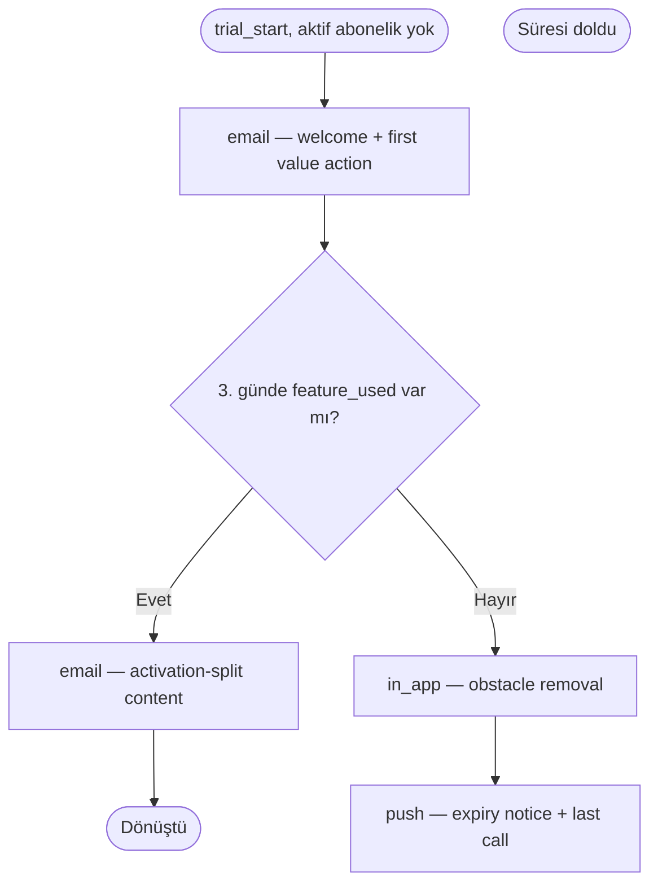

# Journey: Trial Conversion (branched)

**ID:** `saas-trial-conversion-02` · **Version:** 1.0.0 · **Pattern:** trial-conversion · **Priority:** P0
**Data tier:** T2 · **DQS at generation:** 72/100 · **Depth class:** branched (7–12)

## 1. Objective (required)

Convert trial accounts to paid within the trial clock, splitting on activation.

## 2. Trigger & entry (required)

| Field | Value |
|---|---|
| Trigger type | event-based |
| Trigger | `trial_start` |
| Entry conditions | no active subscription |
| Re-entry policy | once per trial |
| Quiet hours | per knowledge/compliance/consent-and-quiet-hours.md |

## 3. Audience (required)

- **Who enters:** trial account admins
- **Who is excluded:** suppressed accounts
- **Estimated volume:** 40

## 4. Exit & success criteria (required)

- **Success (conversion) exit:** `subscription_start` — user leaves the journey immediately.
- **Other exits:** unsubscribe.
- **Success window:** 21 days

## 5. Steps (required)

| # | Wait | Channel | Message intent | Branch condition | Copy ref |
|---|------|---------|----------------|------------------|----------|
| 1 | +1h after trigger | email | welcome + first value action | — | step-1 |
| 2 | +2d | in_app | obstacle removal | no feature_used by day 3 | step-2 |
| 3 | +2d | email | activation-split content | feature_used status | step-3 |
| 4 | +3d | push | expiry notice + last call | — | step-4 |

*Generated from the journey JSON by `scripts/journey_render.py` — do not hand-edit; edit `flow`/`steps` and regenerate.*

## 6. Measurement (required)

| KPI | Type | Definition | Target |
|---|---|---|---|
| trial to paid | primary | conversions vs entered | baseline after 4 weeks |
| unsubscribe rate | guardrail | per send | < 0.3% |

## 7. Frequency & compliance notes (required)

- Standard portfolio precedence applies.

## 8. Flow diagram (required)

