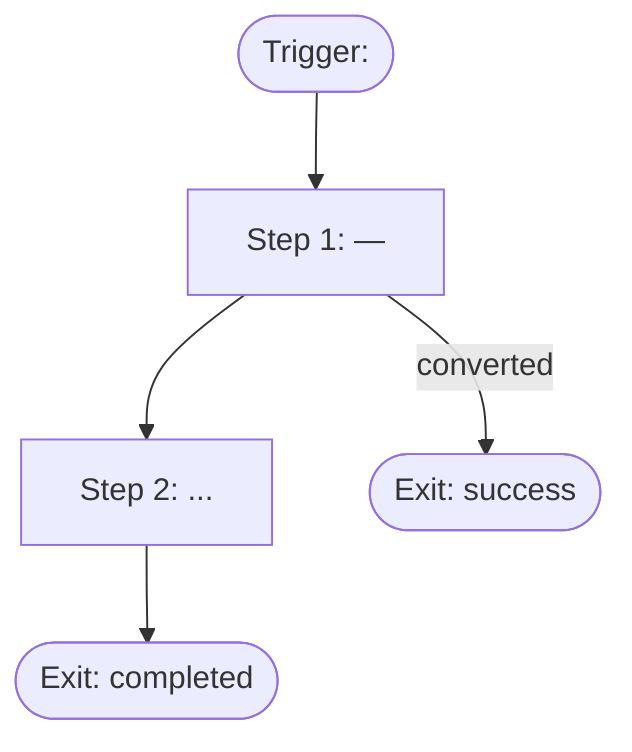

# Journey Doc Template

Every generated journey MUST use this exact structure. Replace `<...>` placeholders.
Sections marked **(required)** may never be omitted; sections marked *(if applicable)* may be dropped only when stated.

---

# Journey: <Human-readable name>

**ID:** `<sector>-<pattern>-<nn>` · **Version:** 1.0.0 *(bump on every change)* · **Pattern:** [<pattern-name>](../knowledge/journey-patterns/<pattern-name>.md) · **Priority:** P0 | P1 | P2
**Data tier:** T1 | T2 | T3 · **DQS at generation:** <n>/100 · **Depth class:** simple (3–5) | standard (4–7) | branched (7–12) *(carry this into the journey JSON's `depth_class` field — the markdown header and the JSON must agree, not just the markdown alone)*
**Vertical:** <vertical name> *(multi-vertical brands only — omit entirely for single-industry brands; carry this into the journey JSON's `vertical` field the same way as Depth class above)*

## 1. Objective (required)

One sentence: what business outcome this journey drives, and the single primary KPI.

## 2. Trigger & entry (required)

| Field | Value |
|---|---|
| Trigger type | event-based \| time-based \| segment-entry |
| Trigger | `<event_name>` or schedule |
| Entry conditions | <all conditions that must hold, incl. consent> |
| Re-entry policy | <e.g. once per 30 days, once ever> |
| Quiet hours | <per knowledge/compliance/consent-and-quiet-hours.md> |

## 3. Audience (required)

- **Who enters:** <segment definition in plain language>
- **Who is excluded:** <exclusions — e.g. purchased in last 24h, in another P0 journey>
- **Estimated volume:** <from data if T1/T2; write "unknown — estimate after launch" if T3>

## 4. Exit & success criteria (required)

- **Success (conversion) exit:** `<event>` — user leaves the journey immediately.
- **Other exits:** unsubscribe, journey completed, entered higher-priority journey.
- **Success window:** <n days>

## 5. Steps (required)

| # | Wait | Channel | Message intent | Branch condition | Copy ref |
|---|------|---------|----------------|------------------|----------|
| 1 | <e.g. +1h after trigger> | email | <one-line intent> | — | step-1 |
| 2 | +24h | push | <intent> | if step 1 not opened | step-2 |
| … | | | | | |

Rules for this table:
- Each step's **wait** is relative to the previous step (or the trigger for step 1).
- **Branch condition** is empty for linear steps; branched journeys (DQS ≥ 70) name the event/behavior that splits the path.
- **Copy ref** links each step to its block in the copy output ([copy-output.md](copy-output.md)).
- **Exception check (mandatory):** every step that follows a wait re-verifies the trigger condition at send time and cancels if it no longer holds — cart already purchased on another device, onboarding already completed, feature already adopted. The success exit alone does not cover cross-device or out-of-band completions; a "still thinking about it?" message after a completed purchase is a trust-killer. State any step-specific exception logic beneath the table.

## 6. Measurement (required)

| KPI | Type | Definition | Target |
|---|---|---|---|
| <e.g. cart recovery rate> | primary | <definition, measured as **incremental lift vs holdout**> | <target or "baseline after 4 weeks"> |
| <e.g. unsubscribe rate> | guardrail | <definition> | <ceiling, e.g. < 0.3% per send> |

- **Metric tiers:** the primary KPI is per-journey and incremental (lift vs holdout); opens/clicks/step conversions are per-step *diagnostics* and never substitute for it — see [measurement.md](../knowledge/measurement.md).
- **Holdout:** <e.g. 10% random pre-launch split, suppressed for the full window> *(required for T1/T2)*
- **Measurement window:** <matched to trigger latency — recovery 1–7d, activation 7–14d, winback 30–90d>
- **A/B plan:** <what is tested first + the hypothesis it decides, e.g. "step-1 A (utility) vs B (social proof) — hypothesis: proof beats utility for repeat buyers". Variant strategy/hypothesis labels live in the copy output and are scored by lifecycle-results.>

## 7. Frequency & compliance notes (required)

- Interaction with frequency caps and other journeys (which journey wins on conflict).
- Consent requirements per channel used (see [consent-and-quiet-hours.md](../knowledge/compliance/consent-and-quiet-hours.md)).

## 8. Flow diagram (required)

## 9. Data gaps *(if applicable)*

Events or attributes that would improve this journey but are not tracked yet → cross-reference the [tracking plan](tracking-plan.md).
